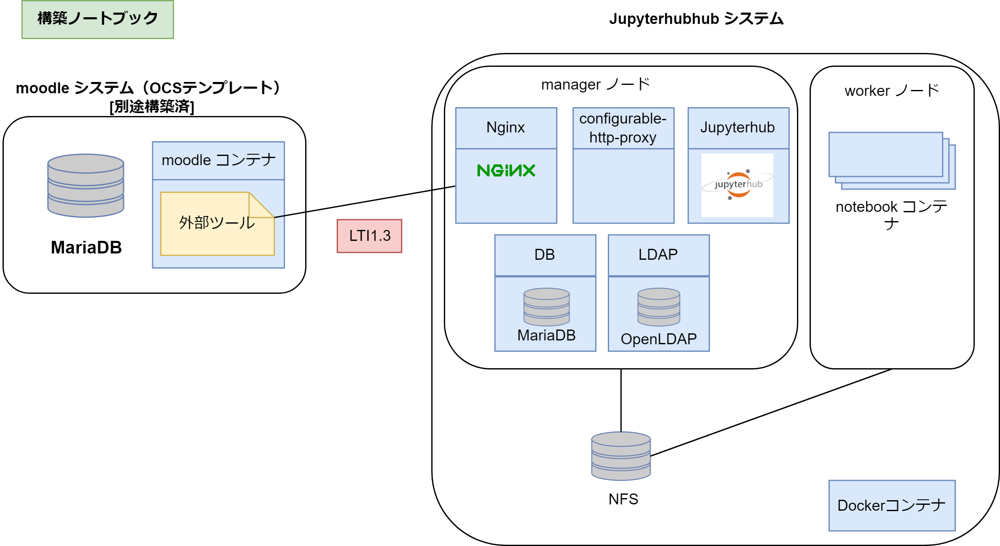

# README

VCP SDKを用いてクラウド上にJupyterHub環境を構築します。

## はじめに

このアプリケーションテンプレートではVCPで作成したノードにJupyterhub環境を構築します。

### JupyterHubのユーザ認証について

JupyterHubではユーザの認証機能としてLTI認証連携（LTI1.1）を使用します。
現在対応しているLMSは、Moodle3.9です。

### コンテナの構成について

コンテナ構成図を以下に示します。

### ノード構成

JupyterHubのノードは役割に応じて以下のものに分類されます

* manager
    - JupyterHub, MariaDBなどのSystemコンテナを実行するノード
    - Docker Swarmのmanagerノードとなる
* worker
    - single-user Jupyter notebook serverを実行するノード
    - Docker Swarm の workerノードとなる
    
JupyterHubではデータやNotebookなどをノード間で共有するためにNFSを利用します。
managerノードがNFSサーバの役割を兼ねる構成としています。
