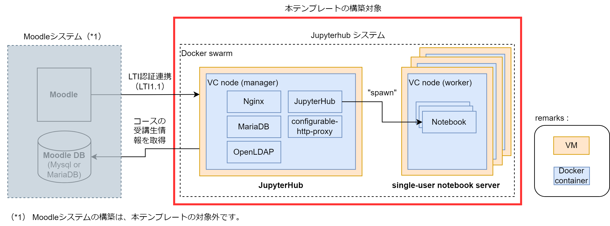

# MCJ-CloudHub

## MCJ-CloudHubとは

複数科目で共同・同時利用可能なWeb型プログラミング演習システムです。
MCJ-CloudHubでは、Web型プログラミング演習環境として[JupyterHub](https://github.com/jupyterhub/jupyterhub)を、課題の配布・回収・採点ツールとして[nbgrader](https://github.com/jupyter/nbgrader)を採用し、複数科目で共同・同時利用可能とするために独自の改修・設定を行っています。
ここではMCJ-CloudHubを[学認クラウドオンデマンド構築サービス（OCS）](https://cloud.gakunin.jp/ocs/)上に構築するアプリケーションテンプレートを公開しています。

### 構築後の利用の流れ

- **LMSから、LTI認証を利用してJupyterHubへログイン**
  LMSの各コースにて、JupyterHubとのLTI認証用設定をすることで、JupyterHubへのログインリンク等が表示されるので、ユーザはこれをクリックしてログインができます。

- **ログインしたユーザ用の[Jupyter Notebook](https://github.com/jupyter/notebook)環境がDockerコンテナで起動する**
  LMSで選択したコースにフォーカスした設定で環境が起動します。
  nbgraderを利用する際に、受講するコースを選択する箇所がありますが、ここにはログイン時に選択していたコースのみが表示されます。
  これにより、ユーザのコース選択誤りを防止します。

- **教師・受講生共に、[nbgrader](https://github.com/jupyter/nbgrader)を利用して課題ファイルのやり取りを行う**

### JupyterHub・nbgraderの改修・設定

MCJ-CloudHubは、以下の方針で作成しています。

- 複数コースでJupyter notebook + nbgrader 環境を同時に使用する
  
  そのためのディレクトリの作成や、各種設定ファイルの自動生成を行います。

- 一度構築した後の管理の手間を極力減らす
  
  JupyterHubを利用する、各コースの担当者がJupyterHub等に詳しいわけではありません。複数コースで使用する場合には各コース用の設定が必要となりますが、コース担当者にとっては大きな負担になります。
  
  そこでMCJ-CloudHubでは、コース担当者がコース用の設定を行う必要が無い仕組みになっています。  

具体的には、以下の特徴があります。  

- **必要なディレクトリの作成**  
  各コース用のディレクトリを作成する必要がありますが、これを自動で行います。
  また、デフォルトのJupyterHubのものとは異なる、独自のディレクトリ構成と権限設定により、複数コースが同時に、柔軟に利用できます。

- **各種設定ファイルの自動作成**  
  JupyterHub設定ファイル（jupyterhub_config.py）、nbgrader設定ファイル（nbgrader_config.py）をログインするユーザ毎に自動作成します。  

- **nbgrader改修（日本標準時対応）**  
  nbgraderで教師ユーザが課題を作成する際、期限を設定するために時刻を入力します。
  日本時間で期限を設定する場合、「+9」と毎回入力する必要があり、また、課題の期限や、提出された課題の提出日時を日本時間で表示することができませんでした。
  この点、nbgrader上は時刻を日本時間で表示・設定できるよう改修しました。

### JupyterHubのユーザ認証

JupyterHubではユーザの認証機能としてLTI認証連携（LTI1.3）を使用します。
動作確認済みのLMSについては、LTI認証設定の手引きを本テンプレートに同梱しています。

- 連携動作確認済みのLMSとそのバージョン
  - **Moodle**
    nbgraderにて受講生情報を取り扱うための設定方法が、LMSのバージョンによって異なります。
    設定が簡単であるため、バージョン4.x.xを推奨しています。
    - 3.9.9
    - 4.0.6(推奨)
    - 4.2.7(推奨)

### システムの構成

構成図を以下に示します。

### ライブラリの修正点等

MCJ-CloudHubでは、ライブラリの改修を行っていたり、独自のディレクトリ構成をとっているため、ライブラリの標準機能で一部使用できないものがあります。

- nbgrader
  
  - quickstartが使用不可  
    quickstartによって作成されるディレクトリや設定ファイルは、MCJ-CloudHubで設定している共通の設定により参照されないようになっているため、使用できません。
  
  - 日本標準時（JST）以外への対応  
    日本標準時（JST）で使用することを前提としているため、変更できません。

### 構成詳細

[学認クラウドオンデマンド構築サービス（OCS）](https://cloud.gakunin.jp/ocs/)では、Docker in Docker の構成で各コンテナが作成されます。
まず、VM上に、アプリケーション全体の基盤となる、ベースコンテナ＝「VCノード」を起動します。
そして、そのベースコンテナ内に各アプリケーションコンテナを起動します。

VCノード（ベースコンテナ）は役割に応じて以下のものに分類されます。

* manager
  
  * システムの管理用のコンテナ
  * JupyterHub, MariaDBなどのSystemコンテナを実行するノード
  * Docker Swarm の managerノードとなる
  * 起動する数は１つのみ
  * NFSサーバを兼ねる

* worker
  
  * 各ユーザの、single-user Jupyter notebook serverを実行するノード
  * Docker Swarm の workerノードとなる
  * 起動する数は任意で、VMの性能や利用者数を勘案して設定する（０以上）

## 外部発表（2025.3.5現在）
Yamaguchi-hubは、山口大学オンプレミス環境で運用中のシステムを指します。MCJ-CloudHubは、Yamaguchi-hubをベースに拡張を行い、OCSテンプレートから構築・運用可能としたシステムを指します。

### 論文
#### MCJ-CloudHub：

複数科目で同時利用可能なWeb型プログラミング演習システムの構築・運用方法の汎用化; 齊藤 智也, 大江 和一, 西井 淳, 岡田 耕一, 爲末 隆弘, 王 躍, 筒井 優子, 丹生 智也, 竹房 あつ子; JACN 学術情報処理研究 No.28 2024 pp.1-12, DOI: 10.24669/jacn.28.1_1

### 研究会発表等
#### Yamaguchi-hub（山口大学オンプレミス環境運用システム）：

MoodleとJupyterHub を用いた Web 型プログラミング教育環境の改善および運用; 齊藤 智也, 王 躍, 西井 淳, 河野 綸華, レール マルク; 研究報告教育学習支援情報システム（CLE）, 2023-CLE-39(8), 1-8 (2023-03-03) , 2188-8620 2023年3月10日 情報処理学会

MoodleとJupyterHubを用いたWeb型プログラミング教育環境の改善事例: 複数科目・複数講師によるNbgraderの共同利用; 齊藤 智也, 王 躍, 西井 淳, 末長 宏康, 大平 康旦, 西村 世志人, 金山 知余, 村永 聡, 爲末 隆弘, 岡田 耕一, レール マルク; 大学ICT推進協議会 2022年度年次大会 2022年12月15日 大学ICT推進協議会

#### MCJ-CloudHub：

MCJ-CloudHubにおける課題配布・回収・採点機能及び複数科目の同時利用に関する動作検証; 齊藤 智也, 大江 和一, 西井 淳, 岡田 耕一, 爲末 隆弘, 王 躍, 矢吹 渓悟, 筒井 優子, 丹生 智也, 竹房 あつ子; 第45回教育学習支援情報システム研究発表会（IPSJ CLE45）  2025年3月21日  情報処理学会

LTI 1.3 を用いた Moodle とプログラミング演習システム の連携機能の開発; 齊藤智也, 大江和一, 西井淳, 岡田耕一, 爲末隆弘, 王躍, 矢吹渓悟, 筒井優子, 丹生智也, 竹房あつ子; MoodleMoot Japan 2025  2025年2月28日  

MCJ-CloudHubの動作検証及び一般公開; 齊藤智也, 大江和一, 西井淳, 岡田耕一, 爲末隆弘, 王躍, 矢吹渓悟, 筒井優子, 丹生智也, 竹房あつ子; AXIES2024  2024年12月12日  

MCJ-CloudHubにおける計算資源量推定機能、及び進捗状況可視化機能の設計; 大江和一, 齊藤智也, 筒井優子, 丹生智也, 西井淳, 岡田耕一, 爲末隆弘, 王躍, 竹房あつ子; AXIES2024  2024年12月12日  

MCJ-CloudHubの動作検証と計算資源量推定機能及び進 捗可視化機能の実装; 齊藤智也, 大江和一, 西井淳, 岡田耕一, 爲末隆弘, 王躍, 矢吹渓悟, 筒井優子, 丹生智也, 竹房あつ子; IPSJ CLE44  2024年11月15日  

複数科目で共同・同時利用可能なWeb 型プログラミング教育支援システムの開発; 大江和一, 齊藤智也, 筒井優子, 丹生智也, 西井 淳, 岡田耕一, 爲末隆弘, 王 躍, 竹房あつ子; IEICE CPSY研究会（SWoPP 2024）  2024年8月9日  情報処理学会、電子情報通信学会、日本応用数理学会

複数科目で共同・同時利用可能なWeb型プログラミング教 育支援システムのアプリケーションテンプレート開発; 齊藤智也, 大江和一, 西井淳, 岡田耕一, 爲末隆弘, 王躍, 筒井優子, 丹生智也, 竹房あつ子; IPSJ 教育学習支援情報システム（CLE）研究会の第42回研究発表会  2024年3月24日  

Web 型プログラミング演習環境のハイブリットクラウド運用に向けた調査， 及びOCS テンプレート開発; 大江和一, 齊藤智也, 筒井優子, 丹生智也, 岡田耕一, 爲末隆弘, 王躍, 竹房あつ子; AXIES 2023  

Web 型プログラミング教育システムの一般公開に向けた改修; 齊藤智也, 大江和一, 岡田耕一, 爲末隆弘, 王躍, 筒井優子, 丹生智也, 竹房あつ子; AXIES 2023  

