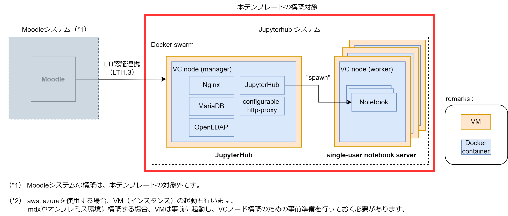

# MCJ-CloudHub

## MCJ-CloudHubとは

[JupyterHub](https://github.com/jupyterhub/jupyterhub) + [nbgrader](https://github.com/jupyter/nbgrader) の環境を構築するためのアプリケーションテンプレートです。
このテンプレートは、[学認クラウドオンデマンド構築サービス（OCS）](https://cloud.gakunin.jp/ocs/)を用いて構築します。
複数コースを同時に扱うために、JupyterHub, nbgraderに独自の改修・設定を行っています。

### 構築後の利用の流れ

- **LMSから、LTI認証を利用してJupyterHubへログイン**
  LMSの各コースにて、JupyterHubとのLTI認証用設定をすることで、JupyterHubへのログインリンク等が表示されるので、ユーザはこれをクリックしてログインができます。

- **ログインしたユーザ用の[Jupyter Notebook](https://github.com/jupyter/notebook)環境がDockerコンテナで起動する**
  LMSで選択したコースにフォーカスした設定で環境が起動します。
  nbgraderを利用する際に、受講するコースを選択する箇所がありますが、ここにはログイン時に選択していたコースのみが表示されます。
  これにより、ユーザのコース選択誤りを防止します。

- **教師・受講生共に、[nbgrader](https://github.com/jupyter/nbgrader)を利用して課題ファイルのやり取りを行う**

### JupyterHub・nbgraderの改修・設定

MCJ-CloudHubは、以下の方針で作成しています。

- 複数コースでJupyter notebook + nbgrader 環境を同時に使用する
  
  そのためのディレクトリの作成や、各種設定ファイルの自動生成を行います。

- 一度構築した後の管理の手間を極力減らす
  
  JupyterHubを利用する、各コースの担当者がJupyterHub等に詳しいわけではありません。複数コースで使用する場合には各コース用の設定が必要となりますが、コース担当者にとっては大きな負担になります。
  
  そこでMCJ-CloudHubでは、コース担当者がコース用の設定を行う必要が無い仕組みになっています。  

具体的には、以下の特徴があります。  

- **必要なディレクトリの作成**  
  各コース用のディレクトリを作成する必要がありますが、これを自動で行います。
  また、デフォルトのJupyterHubのものとは異なる、独自のディレクトリ構成と権限設定により、複数コースが同時に、柔軟に利用できます。

- **各種設定ファイルの自動作成**  
  JupyterHub設定ファイル（jupyterhub_config.py）、nbgrader設定ファイル（nbgrader_config.py）をログインするユーザ毎に自動作成します。  

- **nbgrader改修（日本標準時対応）**  
  nbgraderで教師ユーザが課題を作成する際、期限を設定するために時刻を入力します。
  日本時間で期限を設定する場合、「+9」と毎回入力する必要があり、また、課題の期限や、提出された課題の提出日時を日本時間で表示することができませんでした。
  この点、nbgrader上は時刻を日本時間で表示・設定できるよう改修しました。

### JupyterHubのユーザ認証

JupyterHubではユーザの認証機能としてLTI認証連携（LTI1.3）を使用します。
動作確認済みのLMSについては、LTI認証設定の手引きを本テンプレートに同梱しています。

- 連携動作確認済みのLMSとそのバージョン
  - **Moodle**
    nbgraderにて受講生情報を取り扱うための設定方法が、LMSのバージョンによって異なります。
    設定が簡単であるため、バージョン4.x.xを推奨しています。
    - 3.9.9
    - 4.0.6(推奨)
    - 4.2.7(推奨)

### システムの構成

構成図を以下に示します。

### ライブラリの修正点等

MCJ-CloudHubでは、ライブラリの改修を行っていたり、独自のディレクトリ構成をとっているため、ライブラリの標準機能で一部使用できないものがあります。

- nbgrader
  
  - quickstartが使用不可  
    quickstartによって作成されるディレクトリや設定ファイルは、MCJ-CloudHubで設定している共通の設定により参照されないようになっているため、使用できません。
  
  - 日本標準時（JST）以外への対応  
    日本標準時（JST）で使用することを前提としているため、変更できません。

### 構成詳細

[学認クラウドオンデマンド構築サービス（OCS）](https://cloud.gakunin.jp/ocs/)では、Docker in Docker の構成で各コンテナが作成されます。
まず、VM上に、アプリケーション全体の基盤となる、ベースコンテナ＝「VCノード」を起動します。
そして、そのベースコンテナ内に各アプリケーションコンテナを起動します。

VCノード（ベースコンテナ）は役割に応じて以下のものに分類されます。

* manager
  
  * システムの管理用のコンテナ
  * JupyterHub, MariaDBなどのSystemコンテナを実行するノード
  * Docker Swarm の managerノードとなる
  * 起動する数は１つのみ
  * NFSサーバを兼ねる

* worker
  
  * 各ユーザの、single-user Jupyter notebook serverを実行するノード
  * Docker Swarm の workerノードとなる
  * 起動する数は任意で、VMの性能や利用者数を勘案して設定する（０以上）
