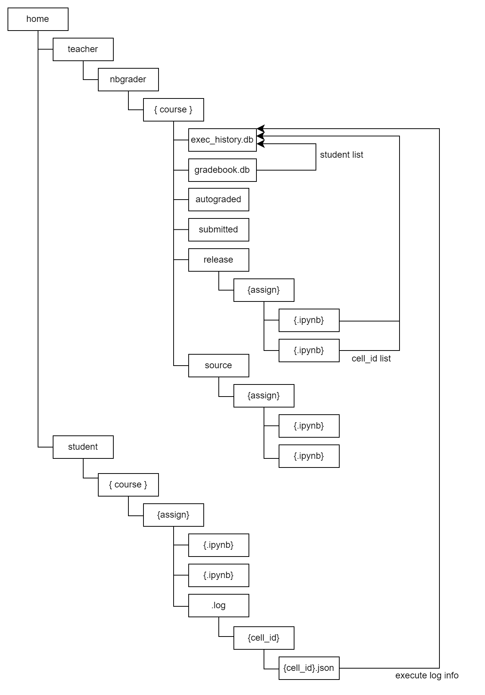

# 実行ログ分析ツール

## 概要

分析ツールは以下の二種類に分かれています。

- オンライン分析（`view_progress.ipynb`）  

  学生がNotebookの課題に取り組んでいる最中に、リアルタイムで進捗を確認する

- オフライン分析（`analyze_log.ipynb`）    

  一通り演習が終了した段階で、どのセルにどのくらいの時間をかけて取り組んでいたのかなどを分析する
  
## 利用手順

### 1. 課題ファイルを作成する

nbgraderを利用し、課題ファイルの作成を行います。  
このとき、各ノートブックにて、利用するカーネルは`LC_wrapper`を選択してください。学生が実行する際に、その実行ログを出力するために`LC_wrapper`を利用する必要があるためです。教師のノートブックで指定していれば、それをダウンロードする学生側でも、初期状態で`LC_wrapper`が選択されているはずですが、他のカーネル（標準のPythonカーネル等）で実行されてしまうと、ログが収集できません。
ここでは、課題の作成→課題で使用するNotebookを作成するところまで行い、配布用課題ファイルの作成（nbgraderの`generate`）以降はまだ行わず、次の手順に進んでください。

### 2. セルごとのIDを振り直す  

教師の作成したノートブックのセルと、学生の実行したセル（の実行履歴）を突き合わせるために、各セルIDが一致している必要があります。  
ノートブックをコピーして利用する場合等、セルIDが重複していると正しくログ情報を収集・分析出来ないケースがあるため、課題用Notebook作成後は必ずセルのIDを振り直す必要があります。  
手順は以下の通りです。

1. terminalを起動し、`/home/ユーザID/nbgrader/コース名/source/課題名`に移動する
2. セルIDを振り直す処理を実行する  
  ```
  ls *.ipynb | xargs -I {} sh -c 'jupyter nblineage new-root-meme --log-level=DEBUG "{}" "{}_"; mv "{}_" "{}"'
  ```

### 3. 課題ファイルの生成・配布  

nbgraderを利用し、学生用課題ファイルの生成（`generate`）・配布（`release`）を行ってください。  
この後、学生がリリースされた課題を取得（`fetch`）し、Notebookを実行すると、ログが出力され、その内容がDBに登録されます。

### 4. 分析ツールを利用して分析  

冒頭に示した、分析用ノートブック（`view_progress.ipynb`、`analyze_log.ipynb`）を利用して、グラフ表示などを行ってください。  
また、これらのNotebookに示したサンプルの他にオリジナルのグラフ等を出力する場合は、以降に示しているスキーマ情報等を参照してください。

## データソース  

各ユーザ（学生）の実行履歴情報は、[`Jupyter-LC_wrapper`](https://github.com/NII-cloud-operation/Jupyter-LC_wrapper)によって出力される実行ログから収集します。  
そのため、**実行履歴を収集したいNotebookでは、各ユーザは、`LC_wrapper`カーネルを選択して実行する必要があります。**  

## ディレクトリ図

教師と学生のディレクトリツリーを図示したものです。（一部省略）  
教師のディレクトリ配下からは、そのコースの学生一覧とノートブックのセル情報を取得し、ログ情報を集積するDB（`exec_history.db`）に登録します。  
学生一覧はnbgraderのDB（`gradebook.db`）から取得するため、nbgrader上の受講生として登録されているユーザが対象となります。つまり、Moodleにて、そのコースに登録されているユーザが対象となります。  

学生のディレクトリ配下からは、その学生の実行履歴情報を収集し、同様にDBに登録します。  
**DBはコース単位に作成されます。**  




## スキーマ情報


### log  

各学生の実行履歴情報を登録します。  
ログファイルの内容をそのまま登録する`log_json`以外のカラムは、`log_{ログファイルでの項目名}`となっています。  
「`assignment`, `student_id`, `log_id`, `log_sequence`」の組に対してユニーク制約を設定しています。

| No. | 論理名                         | 物理名                         | データ型                       | Not Null | デフォルト           | 備考                           |
|----:|:-------------------------------|:-------------------------------|:-------------------------------|:---------|:---------------------|:-------------------------------|
|   1 |                                | id                             | INTEGER                        | Yes (PK) |                      |1からの連番                      |
|   2 |                                | assignment                     | VARCHAR()                      | Yes      |                      |課題名                                |
|   3 |                                | student_id                     | VARCHAR()                      | Yes      |                      |学生ID                                |
|   4 |                                | cell_id                        | VARCHAR()                      | Yes      |                      |セルID                                |
|   5 |                                | log_sequence                   | INTEGER                        | Yes      |                      |何回目の実行かを表す数値              |
|   7 |                                | notebook_name                  | VARCHAR()                      |          |                      |ノートブック名                                |
|   6 |                                | log_json                       | JSON                           |          |                      |ログファイル（.json）全体         |
|   7 |                                | log_code                       | VARCHAR()                      |          |                      |                                |
|   8 |                                | log_path                       | VARCHAR()                      |          |                      |                                |
|   9 |                                | log_start                      | TIMESTAMP                      |          |                      |                                |
|  10 |                                | log_end                        | TIMESTAMP                      |          |                      |                                |
|  11 |                                | log_size                       | INTEGER                        |          |                      |                                |
|  12 |                                | log_server_signature           | VARCHAR()                      |          |                      |                                |
|  13 |                                | log_uid                        | INTEGER                        |          |                      |                                |
|  14 |                                | log_gid                        | INTEGER                        |          |                      |                                |
|  15 |                                | log_notebook_path              | VARCHAR()                      |          |                      |                                |
|  16 |                                | log_lc_notebook_meme           | VARCHAR()                      |          |                      |                                |
|  17 |                                | log_execute_reply_status       | VARCHAR()                      |          |                      |                                |

### cell  

セルの一覧を登録します。  
`log`テーブルと組み合わせることで、まだ誰も実行していないセルを空のデータとして取得する際などに利用できます。  

`section`には、markdownタイプのセルで章（`#`）を記述している場合に、その記述から自動で付与した章番号（`1.1.1`など）が登録されます。 
「`id`, `assignment`」 の組み合わせに対して、ユニーク制約を設定しています。  

| No. | 論理名                         | 物理名                         | データ型                       | Not Null | デフォルト           | 備考                           |
|----:|:-------------------------------|:-------------------------------|:-------------------------------|:---------|:---------------------|:-------------------------------|
|   1 |                                | id                             | VARCHAR()                      | Yes      |                      |セルID                                |
|   2 |                                | assignment                     | VARCHAR()                      | Yes      |                      |課題名                                |
|   2 |                                | section                        | VARCHAR()                      |          |                      |章番号                                |
|   2 |                                | notebook_name                  | VARCHAR()                      |          |                      |ノートブック名                                |


### student

nbgrader上で、コースに登録されている学生一覧を登録します。  
`log`テーブルと組み合わせることで、まだ実行回数が０回の学生データを空データとして取得する際などに利用できます。  

| No. | 論理名                         | 物理名                         | データ型                       | Not Null | デフォルト           | 備考                           |
|----:|:-------------------------------|:-------------------------------|:-------------------------------|:---------|:---------------------|:-------------------------------|
|   1 |                                | id                             | VARCHAR()                      | Yes (PK) |                      |                                |