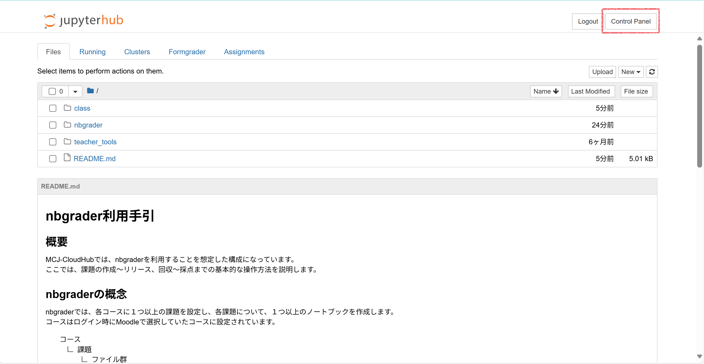
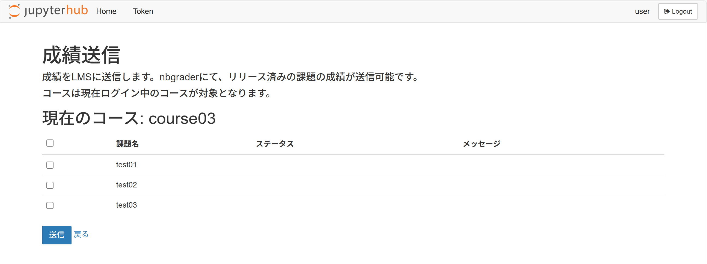

# MCJ-CloudHub利用手引（教員向け）


## 目次

[概要](#概要)  
[nbgrader](#nbgrader)  
[LMSへのフィードバック](#LMSへのフィードバック)  


## 概要

MCJ-CloudHubでは、nbgraderを利用することを想定した構成になっています。  
ここでは、課題の作成～リリース、回収～採点までの基本的な操作方法を説明します。  
また、LMSへの採点結果のフィードバック機能についても説明します。  


## nbgrader

nbgraderでは、各コースに１つ以上の課題を設定し、各課題について、１つ以上のノートブックを作成します。  
コースはログイン時にMoodleで選択していたコースに設定されています。

```
コース
  ∟ 課題
      ∟ ファイル群
```

### 1. 課題作成

1. **Formgrader**画面を開く
  * classic notebook viewの場合、タブの中に`Formgrader`タブがあるのでクリック
  * jupyterlab viewの場合、ツールバーの`Nbgrader`の中に`Formgrader`タブがあるのでクリック

1. **Add new assignment...** をクリックし、表示されたモーダルウィンドウで課題名、締め切り日時（日本時間）を入力  
  課題を作成すると、**Formgrader**画面上のテーブルに、作成した課題が追加されます。課題名をクリックすると、課題用ノートブックの作成先ディレクトリ画面が開きます。  
  ※締め切り日時の設定は任意です。設定した場合、学生の提出が遅れた場合に、遅れた時間によって減点する設定が可能です。[参考: Late submission plugin](https://nbgrader.readthedocs.io/en/0.8.x/plugins/late-plugin.html)

1. 課題ファイル（ノートブック）を作成する  
  **Formgrader**画面にて、課題名をクリックし、課題用ノートブックの作成先ディレクトリ画面を開きます。ここに学生に配布するノートブックを作成します。  
  nbgraderを利用した自動採点等を行う場合、セルに対してnbgrader用の設定を行う必要があります。詳しくは、nbgrader公式ドキュメントをご覧ください。 [参考: Creating and grading assignments](https://nbgrader.readthedocs.io/en/0.8.x/user_guide/creating_and_grading_assignments.html)
  
  ※ **リリースした課題について、学生の実行履歴情報を分析する場合、Notebook実行時に利用するカーネルは`LC_wrapper`を選択する必要があります。詳しくは、`teacher_tools/log_analyze/README.md`をご覧ください。**

### 2. 課題配布  

課題作成を終えると、それを学生に配布する必要があります。ここではその配布の手順を説明します。

1. 配布用ファイル生成  
  **Formgrader**画面にて、`Generate`列にあるアイコンをクリックすると、学生向けに自動修正したノートブックが出力されます。  

  nbgraderを利用して課題の配布・採点を行う場合、教師が作成したノートブックを学生向けに編集したノートブックを作成することが出来ます。  
  特定の文字（デフォルトでは、`### BEGIN SOLUTION`等）を記述した箇所を、nbgraderで学生用に書き換えたノートブックを生成します。
  これにより、教師はノートブック上に解答を記述しておき、配布用ファイルではその部分を置き換えて学生に実装させる、ということが可能です。

1. 課題配布  
  **Formgrader**画面にて、`Release`列にあるアイコンをクリックすると、課題ファイル一式が配布されます。  
  学生側では、この時点から課題のダウンロード・提出が可能となります。  
  学生は何度でも課題の提出が可能ですが、教師が課題の回収を行った際に、最新の提出物が、採点対象となります。

### 3. 課題回収・採点

1. 課題回収  
  **Formgrader**画面にて、`Collect`列にあるアイコンをクリックすると、提出された課題を回収できます。  
   
1. 課題採点
  **Formgrader**画面にて、課題を回収後、`Submissions`列にある数字（提出した人数）をクリックすると、提出された課題を採点できます。  
  自動採点→手動採点 の順に採点します。画面上で「Need Autograding」等の表示がでるので、それらに従って、自動採点・手動採点を行います。  
  手動採点のタイミングで、各セルの記述等に対するコメントや、任意の加点を行うこともできます。  

### 4. 課題返却

1. フィードバック
  自動採点での得点や、手動採点での得点・コメントを集計したHTMLファイルを学生ごとに作成します。
  採点が一通り完了した後に、**Formgrader**画面にて、`Generate Feedback`列のアイコンをクリックすると、HTMLファイルを生成します。  
  生成したHTMLファイルは、`Release Feedback`列のアイコンをクリックすることで、各学生に配布されます。


## LMSへのフィードバック

LMS（Moodle）に採点結果を登録します。  
nbgraderで設定した課題毎に登録要否を選択できます。  

`Control Panel`ボタンからJupyterhub管理画面を開き、画面上部の`Services`ドロップダウンを展開すると、`teachertools`へのリンクがあり、ここから成績送信画面にアクセスします。  




成績情報をLMSに登録する課題にチェックをつけて、送信ボタンを押すことで送信します。  
  


### 注意事項

- 課題情報は送信する度に対象の課題の成績情報を全て上書き  
  → LMS側を手動で編集した場合、その後の成績情報送信で上書きされることに注意してください。

- LMS側への登録名は、nbgraderの課題名をそのまま登録  
  → １つのコースに複数のmcj-cloudhubを連携する場合、コース内で課題名が衝突しないように設定する必要があります。

- 成績を送信すると即座に、学生も自身の成績が閲覧可能となる
